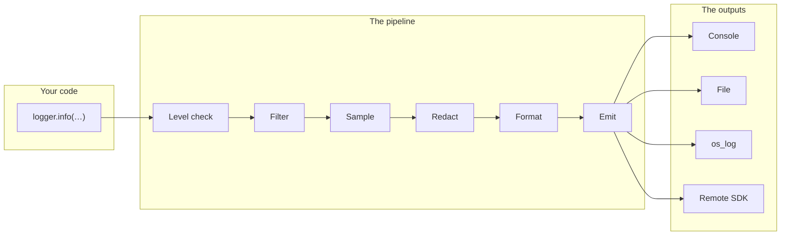
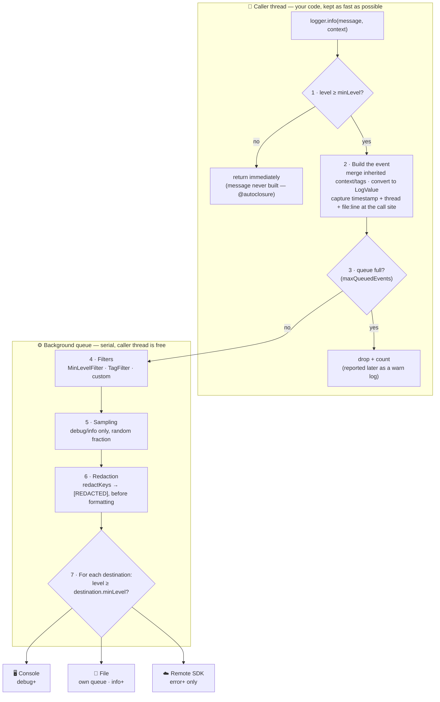

# Architecture — How LogPipe Works

> English | [Tiếng Việt](ARCHITECTURE.vi.md)

This document explains every component of LogPipe, how a log event travels through the system, and which component is responsible for which feature — so that any developer can understand, use, and extend it with confidence.

## Table of Contents

1. [The Big Picture](#1-the-big-picture)
2. [The Journey of One Log Call](#2-the-journey-of-one-log-call)
3. [Components in Detail](#3-components-in-detail)
4. [Threading Model](#4-threading-model)
5. [Which Level Should I Use?](#5-which-level-should-i-use)
6. [Feature → Component Map](#6-feature--component-map)
7. [Extending the Logger](#7-extending-the-logger)

---

## 1. The Big Picture

The package is built around one idea: **a log call creates an event, and the event flows through a pipeline of small, replaceable stages**.



Every stage is a protocol (`LogFilter`, `LogRedactor`, `LogFormatter`, `LogSink`), and the built-in implementations are just defaults. You can swap or add any stage without touching the others.

Two design rules hold everywhere:

- **The caller thread does as little as possible.** Heavy work (filtering, formatting, I/O) happens on a background queue.
- **Everything that crosses a thread boundary is `Sendable`.** The whole package compiles and runs cleanly under Swift 6 strict concurrency.

## 2. The Journey of One Log Call

What exactly happens when you write this?

```swift
logger.info("Order created", tags: ["BUSINESS"], context: ["orderId": "A123"])
```



Step-by-step, with the details the diagram can't hold:

1. **Fast level check** — is `.info >= config.minLevel`? If not, return immediately. Thanks to `@autoclosure`, the message string and context dictionary *have not even been built yet*; a disabled log costs about one lock read.
2. **Build the event** — evaluate message and context (now we know the log will be used), merge inherited context/tags from `withContext()`/`withTags()`, convert context values to `LogValue` (type-safe, `Sendable`), and capture timestamp, thread (`"main"`/`"background"`), and `file:line` **here at the call site** — so they describe *your* code, not the logger's queue.
3. **Backpressure check** — if `maxQueuedEvents` are already waiting, drop this event and count it. The drop is reported later via a synthetic warn log.
4. **Filters** — every `LogFilter` must approve: `MinLevelFilter`, `TagFilter`, your custom ones.
5. **Sampling** — debug/info only: keep a random fraction (`samplingRate`). `warn`/`error`/`fatal` are never sampled away.
6. **Redaction** — keys in `redactKeys` (case-insensitive, recursive) become `[REDACTED]`. Runs *before* formatting, so no sink ever sees the raw value.
7. **Per destination** — for each `LogDestination(formatter, sink, minLevel)`: if the event clears the destination's own level, format it and emit.

**Two special paths:**

- **`fatal`** skips the async hop: it runs the whole pipeline **synchronously** and flushes all sinks before returning — so the event survives even if the app crashes on the very next line.
- **`flush()`** synchronously drains the background queue, then asks every sink to flush its own buffers (e.g. the file sink). Call it when the app goes to background.

## 3. Components in Detail

### `Logger` — the public face (struct)

What your code talks to. It holds three things:

| Field | Purpose |
|---|---|
| `core` | shared engine (see `LoggerCore`) |
| `baseContext` | context inherited from `withContext(...)` |
| `baseTags` | tags inherited from `withTags(...)` |

`Logger` is a tiny struct — copying it is free, and `withContext`/`withTags` just return a copy with extra baggage. **All copies share the same `LoggerCore`**, so they share one queue, one configuration, one set of destinations:

```swift
let base = Logger(...)                       // 1 core, 1 queue
let net  = base.withTags(["NETWORK"])        // same core
let user = net.withContext(["userId": "u1"]) // same core
```

This is why the recommended setup is one shared `Logger` + derived children, never multiple independent `Logger(...)` instances.

It also exposes `updateConfiguration { ... }` (thread-safe runtime changes) and `flush()`.

### `LoggerCore` — the engine (internal)

You never touch it directly. It owns:

- the **configuration** behind an `NSLock` (so the fast path can read `minLevel` synchronously from any thread),
- the **serial background queue** where the pipeline runs,
- the **backpressure counters** (pending + dropped),
- the pipeline itself: filters → sampling → redaction → destinations.

### `LogEvent` — the unit of data

One log call = one immutable `LogEvent`:

| Field | What it is | Why it exists |
|---|---|---|
| `id: UUID` | unique per event | dedup when a remote send is retried |
| `timestamp: Date` | when you called the logger | captured at call site, not when the queue drains |
| `level: LogLevel` | severity | filtering and routing |
| `message: String` | human-readable summary | the headline |
| `tags: [String]` | subsystem labels (`"UI"`, `"NETWORK"`) | filtering, child loggers |
| `context: [String: LogValue]` | structured data | queryable fields on a collector |
| `thread: String?` | `"main"` / `"background"` | debugging threading issues |
| `source: SourceInfo?` | file, function, line | jump straight to the call site |

### `LogLevel` — severity (enum, `Comparable`)

`debug < info < warn < error < fatal`. Being `Comparable` is what makes `minLevel` checks one-liners. See [section 5](#5-which-level-should-i-use) for usage guidance.

### `LogValue` — type-safe context values

Why doesn't `LogEvent` just carry `[String: Any]`? Two reasons:

1. `Any` is not `Sendable` — it can't legally cross to the background queue in Swift 6.
2. `Any` is not `Encodable` — JSON formatting would need fragile runtime casts.

So the public API accepts the convenient `[String: Any]`, and `LogValue.from(_:)` converts it **once, at the call site** into a closed set of cases: `.string`, `.int`, `.double`, `.bool`, `.object`, `.array`, `.null`. Conversion rules:

- All integer types → `.int`; `Float` → `.double`; `Date` → ISO-8601 `.string`; `URL` → `.string`.
- Nested dictionaries/arrays are converted recursively.
- Anything unknown falls back to `String(describing:)` — nothing ever crashes, but custom types arrive as plain strings (be deliberate about what you put in context).

### `LoggerConfiguration` — all the knobs (struct, `Sendable`)

| Field | Default | Controls |
|---|---|---|
| `minLevel` | `.info` | global floor; below it, logs cost almost nothing |
| `enabledTags` | `nil` (all) | tag allow-list for `TagFilter` |
| `redactKeys` | password, token, authorization, cookie, email, phone | which context keys get masked |
| `samplingRate` | `1.0` | fraction of debug/info kept |
| `includeSourceInfo` | `true` | attach file/function/line |
| `includeThread` | `true` | attach `"main"`/`"background"` |
| `maxQueuedEvents` | `1000` | backpressure limit |
| `dateFormatStyle` | ISO-8601, current time zone | timestamp rendering |
| `dateProvider` | `Date.init` | injectable clock — fix it in tests for stable output |

Mutable at runtime via `logger.updateConfiguration { ... }` (e.g. a debug menu that flips `minLevel` to `.debug`).

### `LogFilter` — the gatekeepers (protocol)

```swift
public protocol LogFilter: Sendable {
    func shouldLog(event: LogEvent, config: LoggerConfiguration) -> Bool
}
```

All filters must approve an event, or it is dropped. Built-ins:

- **`MinLevelFilter`** — `event.level >= config.minLevel`.
- **`TagFilter`** — if `enabledTags` is set, the event must carry at least one of them. **Untagged events always pass**, so general logs are never silenced by accident.

### `LogRedactor` — the privacy guard (protocol)

```swift
public protocol LogRedactor: Sendable {
    func redact(context: [String: LogValue], keys: Set<String>) -> [String: LogValue]
}
```

**`DefaultRedactor`** masks any context key in `redactKeys` — case-insensitive, and recursive into nested objects and arrays. It runs **before** formatting, so no formatter or sink ever sees the raw value.

> Limitation to remember: it matches **keys only**. It never scans values or the message string. `logger.info("User \(email) ...")` ships the raw email.

### `LogFormatter` — event → text (protocol)

```swift
public protocol LogFormatter: Sendable {
    func format(event: LogEvent, config: LoggerConfiguration) -> String
}
```

- **`PrettyLogFormatter`** — one readable line for humans:
  `2026-06-07T10:00:00Z [ERROR][BUSINESS]{main} Payment failed {"orderId":"A123"} (Checkout.swift:42 pay())`
- **`JSONLogFormatter`** — one JSON object per line (sorted keys, stable shape) for files and log collectors. If encoding ever fails it degrades to a minimal error JSON instead of throwing.

### `LogSink` — text → destination (protocol)

```swift
public protocol LogSink: Sendable {
    func emit(_ formatted: String, event: LogEvent)
    func flush()   // default: no-op
}
```

`emit` receives both the formatted string **and** the raw event — adapters (analytics, crash reporters) often want structured fields, not the string. Built-ins:

| Sink | Destination | Notes |
|---|---|---|
| `ConsoleLogSink` | `print` | development only |
| `OSLogSink` | unified logging | shows in Console.app & sysdiagnose; maps `fatal` → `.fault`; line is `privacy: .public` (redaction already ran) |
| `FileLogSink` | a file | own serial queue; keeps the handle open; rotates by size (`app.log` → `.1` → `.2`...); recreates the file if deleted; creates parent directories; `flush()` syncs to disk |
| `RemoteLogSink` | your closure | the adapter point for Crashlytics/Sentry/your backend |

### `LogDestination` — formatter + sink + level (struct)

```swift
LogDestination(formatter: JSONLogFormatter(), sink: fileSink, minLevel: .info)
```

Why pair them? Because **the same event usually needs different shapes in different places** — pretty text on the console, JSON in the file, JSON to the remote. And per-destination `minLevel` lets one log call fan out selectively: console gets `debug+`, file `info+`, remote `error+`.

### `LoggerProtocol` — the abstraction for DI and testing

`Logger` conforms to `LoggerProtocol` (which is `Sendable`). Inject the protocol into your services so tests can pass a logger wired to a capturing sink. The protocol extension also provides all the default arguments and the `error(_:error:)` convenience overload, so custom conformers get the full ergonomic API for free.

## 4. Threading Model

| Work | Where it runs |
|---|---|
| Fast level check | caller thread (one lock read) |
| Message/context evaluation, LogValue conversion | caller thread (only if the log passes the level check) |
| Timestamp/thread/source capture | caller thread (so values describe the call site) |
| Filters, sampling, redaction, formatting | `logpipe.core.queue` (serial, `.utility` QoS) |
| Console/OSLog/Remote emit | `logpipe.core.queue` |
| File writes | `FileLogSink`'s own serial queue |
| `fatal` pipeline | caller thread, synchronously (crash safety) |
| `flush()` | caller thread, synchronously drains both queues |

Guarantees that follow:

- **Ordering** — the core queue is serial, so events are processed in the order they were enqueued.
- **No data races** — configuration is read/written behind a lock; every type that crosses the queue boundary is `Sendable`; this is enforced by the Swift 6 compiler, not by convention.
- **Bounded memory** — at most `maxQueuedEvents` events wait in the queue; beyond that, events are dropped and the drop is *reported* (a synthetic warn log), never silent.

## 5. Which Level Should I Use?

| Level | Use for | Examples | Production behavior |
|---|---|---|---|
| `debug` | technical detail useful only to developers | cache hit, JSON parsed, view lifecycle | usually filtered out or heavily sampled |
| `info` | normal business events | user logged in, order created, screen shown | kept locally, sampled if noisy |
| `warn` | something odd, but the app recovered | request retried, slow response, fallback used | always kept; watch for trends |
| `error` | an operation failed; the user is affected | payment failed, API 500, write error | always kept; usually shipped remotely |
| `fatal` | the app cannot continue | database can't open, required config missing | synchronous + flushed; pair with `fatalError()` |

Rule of thumb: *if you'd want to see it while investigating a user complaint, it's `info`+. If you'd page someone about it, it's `error`+.*

## 6. Feature → Component Map

| Feature | Implemented by |
|---|---|
| Near-zero cost for disabled levels | `@autoclosure` in `Logger`/`LoggerProtocol` + lock-protected `minLevel` in `LoggerCore` |
| Context/tag inheritance | `Logger.withContext` / `Logger.withTags` (copies sharing one core) |
| Structured error logging | `error(_:error:)` in `LoggerProtocol` extension |
| Level/tag filtering | `MinLevelFilter`, `TagFilter` |
| Per-destination levels | `LogDestination.minLevel` |
| Sensitive-data masking | `DefaultRedactor` + `redactKeys` |
| Noise/cost control | sampling in `LoggerCore` (`samplingRate`) |
| Log-storm protection | backpressure counters in `LoggerCore` (`maxQueuedEvents`) |
| Crash-safe fatal logs | synchronous fatal path in `LoggerCore.enqueue` |
| Deterministic draining | `Logger.flush()` → core queue + `LogSink.flush()` |
| File rotation & recovery | `FileLogSink` |
| Console.app / sysdiagnose | `OSLogSink` |
| Third-party SDK integration | `RemoteLogSink` (facade pattern) |
| Swift 6 / actor safety | every public type is `Sendable` |
| Testability | `LoggerProtocol` + injectable `dateProvider` + `flush()` |

## 7. Extending the Logger

Each pipeline stage is one small protocol — implement it and pass it in:

| You want to... | Implement | Plug in via |
|---|---|---|
| Send logs somewhere new | `LogSink` | `LogDestination(formatter:sink:minLevel:)` |
| Change the output shape | `LogFormatter` | `LogDestination(formatter:...)` |
| Drop events by custom rules | `LogFilter` | `Logger(filters: [...])` |
| Mask data your own way | `LogRedactor` | `Logger(redactors: [...])` |

Contract for custom components: they must be `Sendable` (the compiler enforces it), `emit` should never throw or block for long (it runs on the shared pipeline queue — do your own queueing for slow I/O, like `FileLogSink` does), and `flush()` should synchronously finish any buffered work.

---

For copy-paste recipes of every use case, see the [README](README.md).
