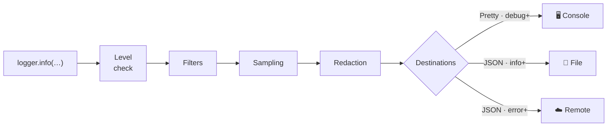

# LogPipe

**A lightweight, production-ready logging pipeline for iOS & macOS — one API, structured events, Swift 6 ready.**

[](https://swift.org)
[](#requirements)
[](#installation)
[](#20-swift-6-concurrency--actors-and-tasks)
[](LICENSE)

> English | [Tiếng Việt](README.vi.md)

Designed to be used everywhere (UI, Network, Business) without creating separate logger types. Every log call flows through one pipeline:



## Highlights

- **One API for every layer** — UI, Network, Business, System.
- **Structured events** — message + tags + typed context, queryable on any collector.
- **Per-destination levels** — console gets `debug+`, file `info+`, remote `error+`, from a single call.
- **Privacy built in** — key-based redaction runs before anything is formatted or emitted.
- **Production safety** — sampling, backpressure with reported drops, file rotation with self-recovery.
- **Crash safe** — `fatal` is synchronous; `flush()` drains everything on demand.
- **Near-zero cost when disabled** — `@autoclosure` fast path: below `minLevel`, the message is never even built.
- **Swift 6 native** — every public type is `Sendable`; use it from any actor, task, or thread.

## Table of Contents

- [Requirements](#requirements) · [Installation](#installation) · [Quick Start](#quick-start)
- [Recommended Production Setup](#recommended-production-setup)
- [Core Concepts](#core-concepts)
- [Use Cases](#use-cases) — 20 copy-paste recipes
- [Formatters & Sinks](#formatters) · [Performance Notes](#performance--reliability-notes)
- [Architecture deep dive →](ARCHITECTURE.md)

## Requirements

| | Minimum |
|---|---|
| iOS | 15.0 |
| macOS | 12.0 |
| Swift | 6.0 (SwiftPM tools 6.0) |

## Installation

Add LogPipe to your `Package.swift`:

```swift
.package(url: "https://github.com/konotori/LogPipe", from: "1.0.0")
```

Or in Xcode: **File → Add Package Dependencies…** and paste the repository URL.

## Quick Start

```swift
import LogPipe

let logger = Logger(
    config: LoggerConfiguration(minLevel: .debug),
    destinations: [
        LogDestination(formatter: PrettyLogFormatter(), sink: ConsoleLogSink())
    ]
)

logger.info("App started")
logger.debug("Cache hit", tags: ["SYSTEM"])
logger.error("Payment failed", tags: ["BUSINESS"], context: ["orderId": "A123"])
```

## Recommended Production Setup

Create **one** shared logger for the whole app (every `Logger(...)` creates its own queue and configuration — you almost always want exactly one), then derive child loggers per module with `withTags`/`withContext`:

```swift
import LogPipe

enum Log {
    static let shared: Logger = {
        #if DEBUG
        // Development: see everything, readable output.
        return Logger(
            config: LoggerConfiguration(minLevel: .debug),
            destinations: [
                LogDestination(formatter: PrettyLogFormatter(), sink: ConsoleLogSink())
            ]
        )
        #else
        // Production: unified logging + rotated file + errors to your crash reporter.
        let logsDir = FileManager.default.urls(for: .applicationSupportDirectory, in: .userDomainMask)[0]
            .appendingPathComponent("Logs")
        let fileSink = FileLogSink(fileURL: logsDir.appendingPathComponent("app.log"))
        let crashReporterSink = RemoteLogSink { formatted, event in
            // Forward to Crashlytics / Sentry / your backend (see "Remote Logging" below)
        }
        return Logger(
            config: LoggerConfiguration(minLevel: .info, samplingRate: 0.2),
            destinations: [
                LogDestination(formatter: PrettyLogFormatter(), sink: OSLogSink(subsystem: "com.your.app"), minLevel: .info),
                LogDestination(formatter: JSONLogFormatter(), sink: fileSink, minLevel: .info),
                LogDestination(formatter: JSONLogFormatter(), sink: crashReporterSink, minLevel: .error)
            ]
        )
        #endif
    }()

    // Per-module child loggers — same pipeline, pre-filled tags.
    static let ui = shared.withTags(["UI"])
    static let network = shared.withTags(["NETWORK"])
    static let business = shared.withTags(["BUSINESS"])
}
```

Because `Logger` is `Sendable`, the `static let` above is fully legal in Swift 6 and the logger can be used from any actor, task, or thread.

## Core Concepts

| Concept | What it is |
|---|---|
| **LogEvent** | the unit of logging — level, message, tags, context, time, thread, source |
| **Logger** | the public API your app calls |
| **Pipeline** | fast level check → filter → sampling → redact → format → emit |
| **Destination** | formatter + sink + per-destination `minLevel` |

> 📖 For a deep dive into every component, the full pipeline walk-through, the
> threading model, and level-choosing guidance, see **[ARCHITECTURE.md](ARCHITECTURE.md)**.

### LogLevel

```swift
public enum LogLevel: Int, Comparable, Sendable {
    case debug, info, warn, error, fatal
}
```

### LoggerConfiguration

```swift
public struct LoggerConfiguration: Sendable {
    var minLevel: LogLevel              // global floor (default .info)
    var enabledTags: Set<String>?       // nil = allow all
    var redactKeys: Set<String>         // case-insensitive key redaction
    var samplingRate: Double            // applies to debug/info only
    var includeSourceInfo: Bool         // file/function/line
    var includeThread: Bool             // "main" / "background", captured at call site
    var maxQueuedEvents: Int            // backpressure limit (default 1000)
    var dateFormatStyle: Date.ISO8601FormatStyle
    var dateProvider: @Sendable () -> Date
}
```

---

## Use Cases

### 1) UI Logging — screen and interaction tracking

```swift
Log.ui.info("Screen appeared", context: ["screen": "Home"])
Log.ui.info("Button tapped", context: ["button": "BuyNow", "screen": "ProductDetail"])
```

### 2) Network Logging — requests and responses

```swift
Log.network.debug("Request", context: ["url": "https://api/login", "method": "POST"])
Log.network.info("Response", context: ["status": 200, "durationMs": 240])
Log.network.warn("Slow response", context: ["url": "https://api/feed", "durationMs": 4200])
```

### 3) Business Logic Logging

```swift
Log.business.info("Order created", context: ["orderId": "A123", "amount": 59.99])
Log.business.error("Payment failed", context: ["reason": "card_declined"])
```

### 4) Logging Errors from `catch` blocks

The `error(_:error:)` overload extracts a structured breakdown of any `Error` — so the whole team logs errors in one consistent, queryable shape:

```swift
do {
    try await paymentService.charge(order)
} catch {
    Log.business.error("Payment failed", error: error, context: ["orderId": order.id])
}
// Context automatically includes:
//   error.type        e.g. "URLError"
//   error.domain      e.g. "NSURLErrorDomain"
//   error.code        e.g. -1009
//   error.description localized description
// User-provided context keys override the generated error.* keys.
```

### 5) Context Inheritance — per-user / per-session loggers

Attach identifiers once; every subsequent log carries them:

```swift
let userLogger = Log.shared.withContext(["userId": "u1", "sessionId": "s1"])
userLogger.info("Profile opened", tags: ["UI"])
// context = { userId: "u1", sessionId: "s1" }

// Call-site context merges with (and overrides) inherited context:
userLogger.info("Plan changed", context: ["plan": "pro"])
```

### 6) Tag Inheritance — per-module loggers

```swift
let networkLogger = Log.shared.withTags(["NETWORK"])
networkLogger.info("Request started", context: ["url": "https://api"])
// tags = ["NETWORK"]
```

### 7) Redaction — keep sensitive data out of logs

Keys listed in `redactKeys` are masked **case-insensitively** and **recursively** (nested objects and arrays included) before formatting and emitting:

```swift
let logger = Logger(
    config: LoggerConfiguration(redactKeys: ["token", "password", "email"])
)

logger.info("Login", context: [
    "email": "a@b.com",
    "password": "123",
    "profile": ["token": "abc"]   // nested keys are redacted too
])
// → email, password, profile.token all become "[REDACTED]"
```

> **Important limitation:** redaction matches **context keys only**. Values and the
> message string are never scanned. `logger.info("User \(email) logged in")` ships
> the raw email — put sensitive data in context under a redacted key instead.

### 8) Sampling — reduce noise and cost in production

Keep a fraction of low-severity logs; `warn`/`error`/`fatal` are never sampled:

```swift
var config = LoggerConfiguration(minLevel: .debug)
config.samplingRate = 0.1   // keep ~10% of debug/info

let logger = Logger(config: config)
logger.debug("This may be sampled out")
logger.warn("This is always kept")
```

### 9) Multiple Destinations with per-destination levels

The classic production split — verbose locally, lean remotely — with one log call:

```swift
let logger = Logger(
    config: LoggerConfiguration(minLevel: .debug),   // global floor
    destinations: [
        LogDestination(formatter: PrettyLogFormatter(), sink: ConsoleLogSink(), minLevel: .debug),
        LogDestination(formatter: JSONLogFormatter(), sink: fileSink, minLevel: .info),
        LogDestination(formatter: JSONLogFormatter(), sink: remoteSink, minLevel: .error)
    ]
)

logger.debug("Cache hit")       // console only
logger.info("Order created")    // console + file
logger.error("Payment failed")  // console + file + remote
```

### 10) File Logging with rotation — "Send logs to support"

`FileLogSink` appends asynchronously, rotates by size (`app.log` → `app.log.1` → `app.log.2`, ...), creates intermediate directories, and recovers automatically if the file is deleted from under it:

```swift
let logsDir = FileManager.default.urls(for: .applicationSupportDirectory, in: .userDomainMask)[0]
    .appendingPathComponent("Logs")
let fileURL = logsDir.appendingPathComponent("app.log")
let fileSink = FileLogSink(fileURL: fileURL, maxFileSize: 5 * 1024 * 1024, maxArchivedFiles: 3)

let logger = Logger(
    destinations: [LogDestination(formatter: JSONLogFormatter(), sink: fileSink)]
)
```

A typical "Send logs to support" feature then just zips `app.log` + `app.log.1...3` and attaches them to a support email — call `logger.flush()` first so nothing is still buffered.

### 11) Unified Logging — Console.app and sysdiagnose

`OSLogSink` forwards to the system's unified logging, so logs from a tester's or user's device show up in Console.app and in sysdiagnose archives, with correct level mapping (`fatal` → `.fault`):

```swift
let logger = Logger(
    destinations: [
        LogDestination(formatter: PrettyLogFormatter(),
                       sink: OSLogSink(subsystem: "com.your.app", category: "default"))
    ]
)
```

> **Privacy note:** `OSLogSink` marks the formatted line as `privacy: .public` —
> redaction has already run, so listed keys are safe, but anything you interpolate
> directly into the message goes to the unified log store in clear text (see the
> redaction limitation above).

### 12) Remote Logging — the facade pattern

In most production apps you do **not** ship every log to a server. The common setup is a crash reporter (Crashlytics, Sentry) where your logs become *breadcrumbs* attached to crash/error reports. Keep LogPipe as the single API your codebase calls, and adapt the SDK behind a sink:

```swift
// Crashlytics example: all logs become breadcrumbs, errors become non-fatal records.
let crashlyticsSink = RemoteLogSink { formatted, event in
    Crashlytics.crashlytics().log(formatted)
    if event.level >= .error {
        let error = NSError(domain: "AppLog", code: 0,
                            userInfo: [NSLocalizedDescriptionKey: event.message])
        Crashlytics.crashlytics().record(error: error)
    }
}

let logger = Logger(destinations: [
    LogDestination(formatter: PrettyLogFormatter(), sink: OSLogSink()),
    LogDestination(formatter: JSONLogFormatter(), sink: crashlyticsSink, minLevel: .info)
])
```

Benefits: vendor swaps touch one file, call sites never change, and **your redaction runs before data leaves the app**.

> If you ship logs to your **own backend**, you also need batching, offline
> persistence, and retry — see Roadmap. Commercial SDKs (Datadog, Sentry) already
> implement that layer; prefer them unless your data must stay on your infrastructure.

### 13) Runtime Config Updates — debug menus, remote config

```swift
// E.g. from a hidden debug menu or a remote-config flag:
logger.updateConfiguration { config in
    config.minLevel = .debug        // turn on verbose logging for this session
    config.samplingRate = 1.0
}
```

### 14) Flush — app termination and critical moments

`flush()` synchronously drains all pending events and flushes every sink (including file buffers). Call it when the app is about to lose execution time:

```swift
// SwiftUI
.onChange(of: scenePhase) { _, phase in
    if phase == .background { Log.shared.flush() }
}

// UIKit
func applicationDidEnterBackground(_ application: UIApplication) {
    Log.shared.flush()
}
```

### 15) Fatal Logging — crash-safe by design

`fatal` events are processed **synchronously** and flushed immediately, so they survive even if the app crashes on the next line:

```swift
guard let database = try? openDatabase() else {
    Log.shared.fatal("Cannot open database", context: ["path": dbPath])
    fatalError("Unrecoverable: database unavailable")
}
```

### 16) Backpressure — log storms can't take the app down

At most `maxQueuedEvents` (default 1000) events are queued at any moment. Excess events are dropped, and the logger reports it honestly with a synthetic warning:

```
[WARN] Logger dropped 250 event(s) due to backpressure
```

```swift
var config = LoggerConfiguration()
config.maxQueuedEvents = 500   // tune if needed
```

### 17) Filtering by tags — focus on one subsystem

```swift
var config = LoggerConfiguration(minLevel: .debug)
config.enabledTags = ["NETWORK"]   // only NETWORK-tagged (and untagged) events pass
```

Untagged events always pass, so general logs are never accidentally silenced.

### 18) Extensibility — custom sinks, formatters, filters, redactors

Every pipeline stage is a public protocol. A custom sink is a few lines:

```swift
struct AnalyticsSink: LogSink {
    func emit(_ formatted: String, event: LogEvent) {
        guard event.tags.contains("ANALYTICS") else { return }
        Analytics.track(event.message, properties: event.context.mapValues { $0.toAny() })
    }
}
```

Available protocols: `LogSink`, `LogFormatter`, `LogFilter`, `LogRedactor`. All are `Sendable`; `LogSink.flush()` has a default no-op, so existing conformers keep compiling.

### 19) Testing — capture logs in unit tests

```swift
final class CapturingSink: LogSink, @unchecked Sendable {
    private let queue = DispatchQueue(label: "tests.capturing")
    private var events: [LogEvent] = []
    func emit(_ formatted: String, event: LogEvent) { queue.sync { events.append(event) } }
    func all() -> [LogEvent] { queue.sync { events } }
}

@Test func ordersAreLogged() {
    let sink = CapturingSink()
    let logger = Logger(destinations: [LogDestination(formatter: JSONLogFormatter(), sink: sink)])

    OrderService(logger: logger).create()
    logger.flush()   // deterministic: no polling needed

    #expect(sink.all().contains { $0.message == "Order created" })
}
```

Inject a fixed `dateProvider` for snapshot-stable output: `config.dateProvider = { Date(timeIntervalSince1970: 0) }`.

### 20) Swift 6 Concurrency — actors and tasks

All public types are `Sendable`. Use the logger freely across isolation domains:

```swift
let logger = Logger()   // can be a global `static let`

actor OrderStore {
    func save(_ order: Order) {
        logger.info("Saving order", context: ["id": order.id])   // ✅ no warnings
    }
}

Task.detached {
    logger.debug("Background refresh started")                    // ✅ no warnings
}
```

Thread info (`"main"`/`"background"`) and timestamps are captured **at the call site**, so they describe where you logged from — not the logger's internal queue.

---

## Formatters

| Formatter | Output | Best for |
|---|---|---|
| `PrettyLogFormatter` | `2026-06-07T10:00:00Z [ERROR][BUSINESS]{main} Payment failed {"orderId":"A123"} (Checkout.swift:42 pay())` | local debugging |
| `JSONLogFormatter` | one JSON object per line, sorted keys, stable shape | files & remote collectors |

## Sinks

| Sink | Destination | Notes |
|---|---|---|
| `ConsoleLogSink` | `print` | development |
| `OSLogSink` | unified logging | Console.app, sysdiagnose |
| `FileLogSink` | file | async appends, size-based rotation, self-recovery |
| `RemoteLogSink` | your closure | adapter for any SDK or backend |

## Performance & Reliability Notes

- Message and context use `@autoclosure`: logs below `minLevel` cost almost nothing — no string building, no context conversion, no queue dispatch.
- Timestamp and thread info are captured at the call site; the heavy pipeline runs on a background queue.
- `fatal` events are processed synchronously and flushed, so they survive an immediate crash.
- Backpressure caps memory under log storms; drops are reported, never silent.
- Redaction happens before formatting and emit, and matches context keys only.
- Sampling only affects debug and info levels.

## Testing

```sh
swift test
```

## Roadmap

- Batched remote sender with offline persistence and retry (for self-hosted backends).
- Payload truncation (size limits for huge context values).

## License

[MIT](LICENSE)
