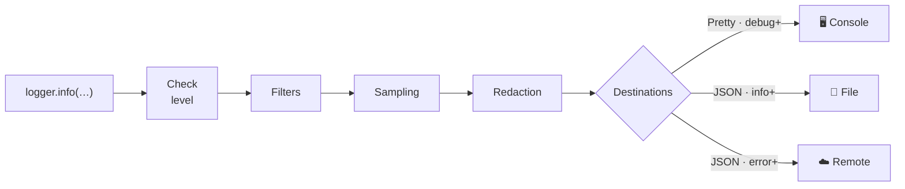

# LogPipe

**Pipeline logging gọn nhẹ, production-ready cho iOS & macOS — một API duy nhất, log có cấu trúc, sẵn sàng Swift 6.**

[](https://swift.org)
[](#yêu-cầu)
[](#cài-đặt)
[](LICENSE)

> [English](README.md) | Tiếng Việt

Thiết kế để dùng được ở mọi tầng (UI, Network, Business) mà không cần tạo nhiều loại logger khác nhau. Mỗi lần gọi log chảy qua một pipeline duy nhất:



## Mục lục

- [Tính năng](#tính-năng)
- [Yêu cầu](#yêu-cầu)
- [Cài đặt](#cài-đặt)
- [Bắt đầu nhanh](#bắt-đầu-nhanh)
- [Setup khuyến nghị cho production](#setup-khuyến-nghị-cho-production)
- [Khái niệm cốt lõi](#khái-niệm-cốt-lõi)
- [Các use case](#các-use-case) — 20 công thức copy-paste
- [Formatters](#formatters)
- [Sinks](#sinks)
- [Ghi chú về hiệu năng & độ tin cậy](#ghi-chú-về-hiệu-năng--độ-tin-cậy)
- [Chạy test](#chạy-test)
- [Roadmap](#roadmap)
- [License](#license)

Tìm hiểu sâu kiến trúc → [ARCHITECTURE.vi.md](ARCHITECTURE.vi.md)

## Tính năng

- **Một API cho mọi tầng** — UI, Network, Business, System.
- **Log có cấu trúc** — message + tags + context có kiểu, query được trên mọi collector.
- **Level riêng từng destination** — console nhận `debug+`, file `info+`, remote `error+`, từ một lần gọi duy nhất.
- **Privacy có sẵn** — redaction theo key chạy trước khi bất cứ thứ gì được format hay emit.
- **An toàn cho production** — sampling, backpressure có báo cáo drop, file rotation tự phục hồi.
- **An toàn khi crash** — `fatal` chạy đồng bộ; `flush()` đẩy hết log đang chờ khi cần.
- **Gần như zero-cost khi bị tắt** — fast path bằng `@autoclosure`: dưới `minLevel`, message còn chưa được tạo ra.
- **Swift 6 native** — mọi public type đều `Sendable`; dùng từ bất kỳ actor, task hay thread nào.

## Yêu cầu

| | Tối thiểu |
|---|---|
| iOS | 15.0 |
| macOS | 12.0 |
| Swift | 6.0 (SwiftPM tools 6.0) |

## Cài đặt

### Xcode

1. **File → Add Package Dependencies…**
2. Dán URL của repo vào ô tìm kiếm:
   ```
   https://github.com/konotori/LogPipe.git
   ```
3. Chọn dependency rule **Up to Next Major Version** từ `1.0.0`, rồi bấm **Add Package**.

### Swift Package Manager

Thêm dependency vào `Package.swift`:

```swift
.package(url: "https://github.com/konotori/LogPipe.git", from: "1.0.0")
```

Rồi thêm `LogPipe` vào target:

```swift
.target(
    name: "MyApp",
    dependencies: ["LogPipe"]
)
```

## Bắt đầu nhanh

```swift
import LogPipe

let logger = Logger(
    config: LoggerConfiguration(minLevel: .debug),
    destinations: [
        LogDestination(formatter: PrettyLogFormatter(), sink: ConsoleLogSink())
    ]
)

logger.info("App started")
logger.debug("Cache hit", tags: ["SYSTEM"])
logger.error("Payment failed", tags: ["BUSINESS"], context: ["orderId": "A123"])
```

## Setup khuyến nghị cho production

Tạo **một** logger dùng chung cho cả app (mỗi lần gọi `Logger(...)` sẽ tạo queue và config riêng — hầu như lúc nào bạn cũng chỉ cần đúng một instance), rồi tạo child logger cho từng module bằng `withTags`/`withContext`:

```swift
import LogPipe

enum Log {
    static let shared: Logger = {
        #if DEBUG
        // Development: thấy mọi thứ, output dễ đọc.
        return Logger(
            config: LoggerConfiguration(minLevel: .debug),
            destinations: [
                LogDestination(formatter: PrettyLogFormatter(), sink: ConsoleLogSink())
            ]
        )
        #else
        // Production: unified logging + file có rotation + lỗi đẩy sang crash reporter.
        let logsDir = FileManager.default.urls(for: .applicationSupportDirectory, in: .userDomainMask)[0]
            .appendingPathComponent("Logs")
        let fileSink = FileLogSink(fileURL: logsDir.appendingPathComponent("app.log"))
        let crashReporterSink = RemoteLogSink { formatted, event in
            // Forward sang Crashlytics / Sentry / backend của bạn (xem mục "Remote Logging" bên dưới)
        }
        return Logger(
            config: LoggerConfiguration(minLevel: .info, samplingRate: 0.2),
            destinations: [
                LogDestination(formatter: PrettyLogFormatter(), sink: OSLogSink(subsystem: "com.your.app"), minLevel: .info),
                LogDestination(formatter: JSONLogFormatter(), sink: fileSink, minLevel: .info),
                LogDestination(formatter: JSONLogFormatter(), sink: crashReporterSink, minLevel: .error)
            ]
        )
        #endif
    }()

    // Child logger theo module — dùng chung pipeline, tags gắn sẵn.
    static let ui = shared.withTags(["UI"])
    static let network = shared.withTags(["NETWORK"])
    static let business = shared.withTags(["BUSINESS"])
}
```

Vì `Logger` là `Sendable`, khai báo `static let` như trên hoàn toàn hợp lệ trong Swift 6, và logger dùng được từ bất kỳ actor, task hay thread nào.

## Khái niệm cốt lõi

| Khái niệm | Là gì |
|---|---|
| **LogEvent** | đơn vị của một lần log — level, message, tags, context, thời gian, thread, source |
| **Logger** | API công khai mà app gọi |
| **Pipeline** | check level nhanh → filter → sampling → redact → format → emit |
| **Destination** | formatter + sink + `minLevel` riêng cho từng đích |

> 📖 Để hiểu sâu từng thành phần, hành trình đầy đủ của pipeline, mô hình threading
> và hướng dẫn chọn level, xem **[ARCHITECTURE.vi.md](ARCHITECTURE.vi.md)**.

### LogLevel

```swift
public enum LogLevel: Int, Comparable, Sendable {
    case debug, info, warn, error, fatal
}
```

### LoggerConfiguration

```swift
public struct LoggerConfiguration: Sendable {
    var minLevel: LogLevel              // mức tối thiểu chung (mặc định .info)
    var enabledTags: Set<String>?       // nil = cho phép tất cả
    var redactKeys: Set<String>         // che theo key, không phân biệt hoa thường
    var samplingRate: Double            // chỉ áp dụng cho debug/info
    var includeSourceInfo: Bool         // file/function/line
    var includeThread: Bool             // "main" / "background", lấy tại call site
    var maxQueuedEvents: Int            // giới hạn backpressure (mặc định 1000)
    var dateFormatStyle: Date.ISO8601FormatStyle
    var dateProvider: @Sendable () -> Date
}
```

## Các use case

### 1) Log UI — theo dõi màn hình và tương tác

```swift
Log.ui.info("Screen appeared", context: ["screen": "Home"])
Log.ui.info("Button tapped", context: ["button": "BuyNow", "screen": "ProductDetail"])
```

### 2) Log Network — request và response

```swift
Log.network.debug("Request", context: ["url": "https://api/login", "method": "POST"])
Log.network.info("Response", context: ["status": 200, "durationMs": 240])
Log.network.warn("Slow response", context: ["url": "https://api/feed", "durationMs": 4200])
```

### 3) Log Business Logic

```swift
Log.business.info("Order created", context: ["orderId": "A123", "amount": 59.99])
Log.business.error("Payment failed", context: ["reason": "card_declined"])
```

### 4) Log lỗi từ khối `catch`

Overload `error(_:error:)` tự tách `Error` thành các field có cấu trúc — cả team log lỗi theo đúng một format, query được trên collector:

```swift
do {
    try await paymentService.charge(order)
} catch {
    Log.business.error("Payment failed", error: error, context: ["orderId": order.id])
}
// Context tự động bao gồm:
//   error.type        vd: "URLError"
//   error.domain      vd: "NSURLErrorDomain"
//   error.code        vd: -1009
//   error.description mô tả lỗi (localized)
// Key trong context bạn truyền vào sẽ ghi đè các key error.* được sinh tự động.
```

### 5) Kế thừa context — logger theo user / session

Gắn định danh một lần; mọi log sau đó tự mang theo:

```swift
let userLogger = Log.shared.withContext(["userId": "u1", "sessionId": "s1"])
userLogger.info("Profile opened", tags: ["UI"])
// context = { userId: "u1", sessionId: "s1" }

// Context tại chỗ gọi được merge vào và ghi đè context kế thừa:
userLogger.info("Plan changed", context: ["plan": "pro"])
```

### 6) Kế thừa tags — logger theo module

```swift
let networkLogger = Log.shared.withTags(["NETWORK"])
networkLogger.info("Request started", context: ["url": "https://api"])
// tags = ["NETWORK"]
```

### 7) Redaction — không để dữ liệu nhạy cảm lọt vào log

Các key có trong `redactKeys` sẽ bị che — **không phân biệt hoa thường** và **áp dụng đệ quy** (cả object/array lồng nhau) — trước khi format và emit:

```swift
let logger = Logger(
    config: LoggerConfiguration(redactKeys: ["token", "password", "email"])
)

logger.info("Login", context: [
    "email": "a@b.com",
    "password": "123",
    "profile": ["token": "abc"]   // key nằm trong object lồng nhau cũng bị che
])
// → email, password, profile.token đều thành "[REDACTED]"
```

> **Giới hạn quan trọng:** redaction chỉ so khớp **key trong context**. Giá trị và
> chuỗi message không bao giờ được quét. `logger.info("User \(email) logged in")`
> sẽ làm lộ email — hãy đặt dữ liệu nhạy cảm vào context dưới một key có trong
> `redactKeys` thay vì nội suy thẳng vào message.

### 8) Sampling — giảm noise và chi phí trong production

Chỉ giữ lại một phần log mức thấp; `warn`/`error`/`fatal` không bao giờ bị sample:

```swift
var config = LoggerConfiguration(minLevel: .debug)
config.samplingRate = 0.1   // giữ ~10% debug/info

let logger = Logger(config: config)
logger.debug("This may be sampled out")
logger.warn("This is always kept")
```

### 9) Nhiều destination, mỗi nơi một level riêng

Cách chia kinh điển trong production — local thì chi tiết, remote thì tinh gọn — chỉ với một lần gọi log:

```swift
let logger = Logger(
    config: LoggerConfiguration(minLevel: .debug),   // mức tối thiểu chung
    destinations: [
        LogDestination(formatter: PrettyLogFormatter(), sink: ConsoleLogSink(), minLevel: .debug),
        LogDestination(formatter: JSONLogFormatter(), sink: fileSink, minLevel: .info),
        LogDestination(formatter: JSONLogFormatter(), sink: remoteSink, minLevel: .error)
    ]
)

logger.debug("Cache hit")       // chỉ console
logger.info("Order created")    // console + file
logger.error("Payment failed")  // console + file + remote
```

### 10) Log ra file có rotation — tính năng "Gửi log cho support"

`FileLogSink` ghi append bất đồng bộ, tự rotate khi file vượt dung lượng tối đa (`app.log` → `app.log.1` → `app.log.2`, ...), tự tạo thư mục trung gian, và tự phục hồi nếu file bị xóa giữa chừng:

```swift
let logsDir = FileManager.default.urls(for: .applicationSupportDirectory, in: .userDomainMask)[0]
    .appendingPathComponent("Logs")
let fileURL = logsDir.appendingPathComponent("app.log")
let fileSink = FileLogSink(fileURL: fileURL, maxFileSize: 5 * 1024 * 1024, maxArchivedFiles: 3)

let logger = Logger(
    destinations: [LogDestination(formatter: JSONLogFormatter(), sink: fileSink)]
)
```

Tính năng "Gửi log cho support" điển hình chỉ cần zip `app.log` + `app.log.1...3` rồi đính kèm vào email support — nhớ gọi `logger.flush()` trước để không sót log còn trong buffer.

### 11) Unified Logging — Console.app và sysdiagnose

`OSLogSink` chuyển log vào unified logging của hệ thống, nên log từ thiết bị của tester hay người dùng sẽ xuất hiện trong Console.app và trong sysdiagnose, với mapping level chính xác (`fatal` → `.fault`):

```swift
let logger = Logger(
    destinations: [
        LogDestination(formatter: PrettyLogFormatter(),
                       sink: OSLogSink(subsystem: "com.your.app", category: "default"))
    ]
)
```

> **Lưu ý về privacy:** `OSLogSink` đánh dấu dòng log là `privacy: .public` —
> redaction đã chạy trước đó nên các key đã khai báo là an toàn, nhưng bất cứ thứ gì
> bạn nội suy thẳng vào message sẽ nằm trong unified log dưới dạng clear text
> (xem giới hạn của redaction ở trên).

### 12) Remote Logging — pattern facade

Trong đa số app production, bạn **không** ship toàn bộ log lên server. Setup phổ biến là dùng crash reporter (Crashlytics, Sentry): log của bạn trở thành *breadcrumbs* đính kèm crash/error report. Giữ LogPipe làm API duy nhất mà codebase gọi, còn SDK chỉ là một sink phía sau:

```swift
// Ví dụ Crashlytics: mọi log thành breadcrumb, lỗi thành non-fatal record.
let crashlyticsSink = RemoteLogSink { formatted, event in
    Crashlytics.crashlytics().log(formatted)
    if event.level >= .error {
        let error = NSError(domain: "AppLog", code: 0,
                            userInfo: [NSLocalizedDescriptionKey: event.message])
        Crashlytics.crashlytics().record(error: error)
    }
}

let logger = Logger(destinations: [
    LogDestination(formatter: PrettyLogFormatter(), sink: OSLogSink()),
    LogDestination(formatter: JSONLogFormatter(), sink: crashlyticsSink, minLevel: .info)
])
```

Lợi ích: đổi vendor chỉ phải sửa một file, chỗ gọi log không bao giờ đổi, và **redaction của bạn chạy trước khi dữ liệu rời khỏi app**.

> Nếu ship log về **backend tự dựng**, bạn cần thêm batching, lưu trữ offline và
> retry — xem Roadmap. Các SDK thương mại (Datadog, Sentry) đã làm sẵn tầng đó;
> nên dùng các SDK này trừ khi dữ liệu bắt buộc phải nằm trên hạ tầng của bạn.

### 13) Đổi config lúc runtime — debug menu, remote config

```swift
// Ví dụ: từ debug menu ẩn hoặc một flag remote-config:
logger.updateConfiguration { config in
    config.minLevel = .debug        // bật log chi tiết cho phiên này
    config.samplingRate = 1.0
}
```

### 14) Flush — khi app sắp bị tạm dừng

`flush()` xử lý đồng bộ toàn bộ event đang chờ và flush mọi sink (gồm cả buffer của file). Gọi khi app sắp vào background hoặc sắp bị kill:

```swift
// SwiftUI
.onChange(of: scenePhase) { _, phase in
    if phase == .background { Log.shared.flush() }
}

// UIKit
func applicationDidEnterBackground(_ application: UIApplication) {
    Log.shared.flush()
}
```

### 15) Log fatal — không bị mất khi app crash

Event `fatal` được xử lý **đồng bộ** và flush ngay lập tức, nên vẫn còn nguyên kể cả khi app crash ở đúng dòng kế tiếp:

```swift
guard let database = try? openDatabase() else {
    Log.shared.fatal("Cannot open database", context: ["path": dbPath])
    fatalError("Unrecoverable: database unavailable")
}
```

### 16) Backpressure — log storm không thể làm sập app

Tại một thời điểm, tối đa `maxQueuedEvents` (mặc định 1000) event được xếp hàng chờ xử lý. Event vượt ngưỡng sẽ bị drop, và logger luôn báo lại bằng một warning tự sinh:

```
[WARN] Logger dropped 250 event(s) due to backpressure
```

```swift
var config = LoggerConfiguration()
config.maxQueuedEvents = 500   // tinh chỉnh nếu cần
```

### 17) Lọc theo tags — tập trung vào một subsystem

```swift
var config = LoggerConfiguration(minLevel: .debug)
config.enabledTags = ["NETWORK"]   // chỉ event có tag NETWORK (và event không có tag) được đi qua
```

Event không có tag luôn được cho qua, nên log chung không bao giờ bị tắt nhầm.

### 18) Mở rộng — tự viết sink, formatter, filter, redactor

Mọi tầng của pipeline đều là public protocol. Viết một sink mới chỉ mất vài dòng:

```swift
struct AnalyticsSink: LogSink {
    func emit(_ formatted: String, event: LogEvent) {
        guard event.tags.contains("ANALYTICS") else { return }
        Analytics.track(event.message, properties: event.context.mapValues { $0.toAny() })
    }
}
```

Các protocol có sẵn: `LogSink`, `LogFormatter`, `LogFilter`, `LogRedactor`. Tất cả đều `Sendable`; `LogSink.flush()` có sẵn implementation mặc định (không làm gì) nên các conformer hiện có vẫn compile bình thường.

### 19) Testing — capture log trong unit test

```swift
final class CapturingSink: LogSink, @unchecked Sendable {
    private let queue = DispatchQueue(label: "tests.capturing")
    private var events: [LogEvent] = []
    func emit(_ formatted: String, event: LogEvent) { queue.sync { events.append(event) } }
    func all() -> [LogEvent] { queue.sync { events } }
}

@Test func ordersAreLogged() {
    let sink = CapturingSink()
    let logger = Logger(destinations: [LogDestination(formatter: JSONLogFormatter(), sink: sink)])

    OrderService(logger: logger).create()
    logger.flush()   // deterministic: không cần polling

    #expect(sink.all().contains { $0.message == "Order created" })
}
```

Inject một `dateProvider` cố định để output ổn định: `config.dateProvider = { Date(timeIntervalSince1970: 0) }`.

### 20) Swift 6 Concurrency — actor và task

Mọi public type đều `Sendable`. Dùng logger thoải mái giữa các isolation domain:

```swift
let logger = Logger()   // có thể là `static let` toàn cục

actor OrderStore {
    func save(_ order: Order) {
        logger.info("Saving order", context: ["id": order.id])   // ✅ không warning
    }
}

Task.detached {
    logger.debug("Background refresh started")                    // ✅ không warning
}
```

Thông tin thread (`"main"`/`"background"`) và timestamp được lấy **ngay tại chỗ gọi log**, nên chúng mô tả đúng code của bạn — không phải queue nội bộ của logger.

## Formatters

| Formatter | Output | Phù hợp cho |
|---|---|---|
| `PrettyLogFormatter` | `2026-06-07T10:00:00Z [ERROR][BUSINESS]{main} Payment failed {"orderId":"A123"} (Checkout.swift:42 pay())` | debug local |
| `JSONLogFormatter` | mỗi dòng một JSON object, key được sort, format ổn định | file & remote collector |

## Sinks

| Sink | Đích | Ghi chú |
|---|---|---|
| `ConsoleLogSink` | `print` | development |
| `OSLogSink` | unified logging | Console.app, sysdiagnose |
| `FileLogSink` | file | ghi bất đồng bộ, rotation theo dung lượng, tự phục hồi |
| `RemoteLogSink` | closure của bạn | adapter cho mọi SDK hoặc backend |

## Ghi chú về hiệu năng & độ tin cậy

- Message và context dùng `@autoclosure`: log dưới `minLevel` gần như không tốn chi phí — không build string, không convert context, không dispatch queue.
- Timestamp và thread được lấy tại chỗ gọi log; phần xử lý nặng chạy trên background queue.
- Event `fatal` được xử lý đồng bộ và flush ngay, không bị mất kể cả khi app crash ngay sau đó.
- Backpressure giữ memory trong giới hạn khi có log storm; mọi event bị drop đều được báo lại, không drop âm thầm.
- Redaction chạy trước khi format và emit, chỉ so khớp key trong context.
- Sampling chỉ ảnh hưởng debug và info.

## Chạy test

```sh
swift test
```

## Roadmap

- Gửi remote theo batch, kèm lưu trữ offline và retry (cho backend tự dựng).
- Truncate payload (giới hạn dung lượng cho các giá trị context quá lớn).

## License

[MIT](LICENSE)
